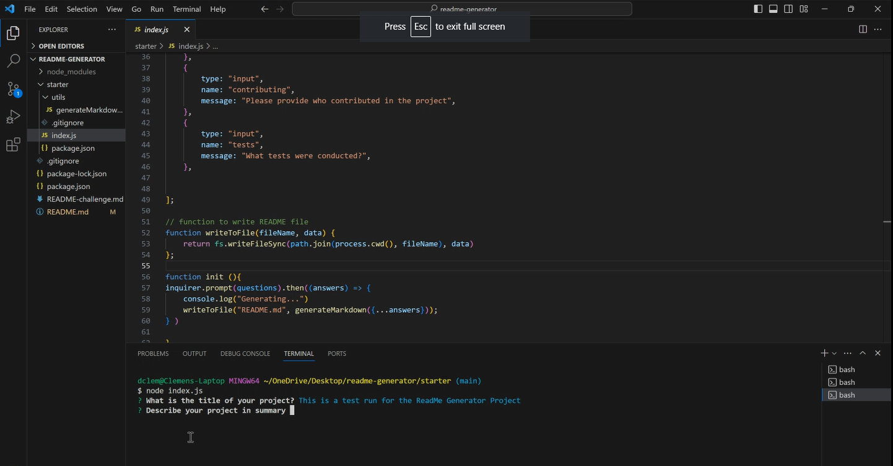

# ReadMe Generator Project

### Description

In this project we will be creating using javascript and command-line application with node to build an automated readMe generator. The purpose of this is so that it easily creates a README file by using a command-line application to generate one. This allows the project creator to devote more time to working on the project.

### Table of Contents:
* Descirption
* Table of Contents
* Instaltion
* Usage
* Licence
* Refections
* Tests
* Contributing
* Questions 

##### Acceptance Criteria

* Create a command-line application that accepts user input.
  * When a user is prompted for information about the application repository then a high-quality, professional README.md is generated with:
    * The title of my project 
    * Sections entitled:
      * Description 
      * Table of Contents 
      * Installation 
      * Usage 
      * License 
      * Contributing 
      * Tests 
      * Questions
* When a user enters the project title then it is displayed as the title of the README
* When a user enters a description, installation instructions, usage information, contribution guidelines, and test instructions then this information is added to the sections of the README entitled Description, Installation, Usage, Contributing, and Tests
* When a user chooses a license for their application from a list of options then a badge for that license is added near the top of the README and a notice is added to the section of the README entitled **License** that explains which license the application is covered under
* When a user enters their GitHub username then this is added to the section of the README entitled Questions, with a link to their GitHub profile
* When a user enters their email address then this is added to the section of the README entitled Questions, with instructions on how to reach them with additional questions
* When a user clicks on the links in the **Table of Contents** then they are taken to the corresponding section of the README

### Installation 
In order to contribute to the task we must install Visual Studio Code or similar. We would also need to install an extension within Visual Studio Code We will require a terminal/bash to create a repository that will enable us to push the code base onto GitHub. For this we will need to install Gitbash as well. You will need use the terminal via Visual studio code or git bash to install node and the relavent depenedcies such as package.json.

### Usage
First we will need to clone the repositary of the application. This can be done via the following link: https://github.com/dcleme51/readme-generator
Then you will need to open the repositary in visual studio code.
Followed by opening the terminal to install the nesscary depenedcies. this can be done by npm install.
You will then be able to open the command-line application within the folder by performing node index.js
After this you will have a series of questions/prompts tp follow filling out the details and by the end of the process a readMe will be generated.

You can follow the link here to watch the application in use.
https://watch.screencastify.com/v/1DbNZlahBgVa0O9vL1Yn 

### Licence
I have chosen the MIT licence as it allows people to do almost anything to the project to help improve the application further if required. It is also a simple and permissive in comparison to other licences.

### Reflection
The assignment was challenging as it was the first time being exposed to node and package.json but I was able to use a variety of resource to help achieve the end result of this project where I was able to complete the readMe generator. The main challenge for me was understanding this function and how to imply it into the logic using command-line.

### Tests
No tests where required for this project.

### Contributing
Instructor and TAs from the bootcamp, AskBSC community members and special thanks to tutor Scott Everet and Suresh Kumar for helping me across this challenge.

### Questions
For any questions regarding this proeject please reach out via GitHub - https://github.com/dcleme51 or email: dcleme51@gmail.com

